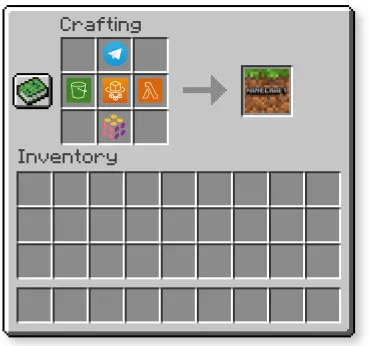
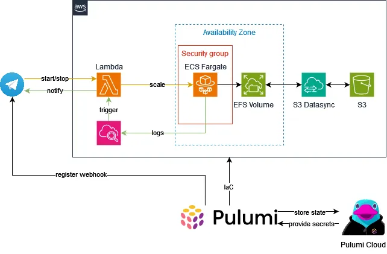

> Platform Engineering is basically like Minecraft. You carefully craft the best possible solution in a world with unlimited possibilities, only for some thing to blow up and ruin your day. Then you rebuild and create something even more awesome…

And as in real world, the fun starts, once you work together with other people. Hosting an own server requires either a rather high commitment to some public hosting provider (at least if you only play from time to time, like me) or to self-host your server with all the caveats attached.

So, we need some solution that 
- hosts a minecraft server on-demand,
- can be controlled by multiple players,
- is affordable and
- requires as less work as possible to setup & maintain.

# Concept

Let’s try to come up with a solution for this problem.




We will host the server on AWS ECS Fargate, the managed container runtime offered by AWS. A telegram bot that is calling a lambda function with a webhook will trigger scaling to start and stop the server. By reading log events, we can give feedback to the users in telegram, e.g. when the server is ready to accept connections. The data for the server is stored in AWS Elastic File System (EFS). To import/export world data, we can use S3 Datasync to synchronize the EFS with a S3 bucket.

All of this, we will set up with Pulumi, my favourite IaC (Infrastructure-as-code) solution that allows us to define our infrastructure in different programming languages (I will use Typescript here). Optionally, you can use free Pulumi Cloud to store the state of your infrastructure and environment variables or secrets.

> Talk is cheap! How much will this server cost me??

Most of this solution is covered by AWS Free Tier. You will have to pay a small fee for the ECS Runtime while the server is running. Spot Instances allow you to use spare compute capacity by AWS. With this I made a test and running this server was 0,63$ per day for 1 vCPU & 8 GB RAM. Interestingly, it was never interrupted until now, and even if it would be, the server has enough time to grafecully shut down.

Let’s start! You skip the talk and directly go to the [git repository](https://github.com/hghtwr/minecraft-ecs-telegram).

# Prerequisites
You will need a few things:

- An AWS Account with free tier which you can set up here.
- A Pulumi cloud account you can setup here. Alternatively, you can find plenty of info how to store your state in a S3 bucket, if you don’t want to use cloud.
- Pulumi CLI, Pulumi ESC & AWS CLI installed on your computer.

# Setup Telegram Bot & Get chat id

Unfortunately, you will have to start with a manual step and create a new telegram bot using BotFather as described in the telegram docs. Make sure to copy the api token you receive.

> But you said we will do everything automatically!?

Well, reality hits. If you find a way to create a bot without interacting manually with the BotFather, let me know. We can also automate API calls with Pulumi, more on this later 😎.

After you added this bot to a chatgroup, we can extract the chat id. Later we will use this to restrict access to our control commands to this chat group only. You don’t want the whole world to interact with your minecraft server!

To do this, add the bot to the group and send a message. Afterwards, use the [GetUpdates](https://core.telegram.org/bots/api#getupdates) endpoint of the telegram API and extract the chat id.

# Optional: Set up Pulumi ESC (Environments, Secrets & Configuration)

You can skip this step and store the chat id and api token simply as shell environment variable, using your preferred method (e.g. direnv). Nevertheless, I like Pulumi ESC as I have secure access to the values even if I’m on another machine (you obviously don’t want to check them in into your git repository).

Pulumi ESC allows us to store the configuration, secrets and environment details in Pulumi Cloud and get them during local execution of our pulumi program. Simply head over to their cloud, create a new environment and paste the values from the previous step into this environment. We will use it only for the chat id and api token. The rest of our configuration stays in Git as I simply prefer to have everything in Git, if possible. The built-in function for secrets will make sure that the value is stored as ciphertext.

```yaml
# See https://www.pulumi.com/docs/esc/reference/ for additional examples.

[...]

# values is a required top-level key
values:
  telegram:
    chatId: <chatId>
    apiToken:
      fn::secret: <apiToken>

  # ---------------------------------------------------------------------------------------
  # Exports -- expose configuration values to particular consumers
  # ---------------------------------------------------------------------------------------

  # Configuration nested under the "environmentVariables" key is used to export environment
  # variables when using `esc open --format shell`, `esc run`, or `pulumi up/preview/refresh/destroy`
  environmentVariables:
    TELEGRAM_API_TOKEN: ${telegram.apiToken}
    TELEGRAM_CHAT_ID: ${telegram.chatId}
```
Now, import these environment variables to your shell:

```sh
eval $(esc env open <pulumiorg>/<environment-name> --format shell)
```
By the way, you can also use this method, to store your AWS Access Key ID & Secret in your Pulumi cloud environment. If you have a paid version of Pulumi Cloud, you can use an Organization to share this access key between multiple developers (if you should do this, is another question…).

# Pulumi comes into action

To begin, clone the git repository. You can start customizing your server instance using the Pulumi.*.yaml files. Each of these files represents one stack, means one installation of this program. First select a stack, then run a preview or directly install all the infrastructure in one go.

```sh
~/minecraft-ecs-telegram$ npm install ## First install the dependencies for pulumi
~/minecraft-ecs-telegram$ pulumi stack select dev # Will select Pulumi.dev.yaml
~/minecraft-ecs-telegram$ pulumi preview ## Will show you what will be installed 
~/minecraft-ecs-telegram$ pulumi up ## And let's go :) 
```

I will not explain all the source code in detail, it’s quite boring. You can check out their very good [documentation](https://www.pulumi.com/docs/) instead. I will only highlight some ideas.

## 1. Lambda Setup 

Using a `Makefile` we can automatically create .zip files from our lambda code to be uploaded. Don’t forget to run make build when you change something in the handlers. This is quite convenient. The telegram bot handlers are written in python, using telebot. Telegram bots are originally designed to listen to a specific port. With lambda, we need an invocation. Therefore, we change the telegram bot to trigger a webhook when receiving a command. And because Pulumi is awesome, we can do this rather easily. We can automatically issue an API call to the Telegram API with the lambda invocation url to be set as webhook for incoming messages 😎.

```ts 
const telegramWebhook = new local.Command("telegram-webhook", {
 triggers: [mcTelegramBot.commandHandlerFunctionUrl.functionUrl],
create: pulumi.interpolate `curl --data \"url=${mcTelegramBot.commandHandlerFunctionUrl.functionUrl}\" https://api.telegram.org/bot${process.env.TELEGRAM_API_TOKEN}/setWebhook`
});

export const webhookResult = telegramWebhook.stdout;

``` 
All of this allow us to enable lambda to react to messages sent to the bot, e.g. /start to start our server.

## 2. Pulumi Configs & Defaults

Pulumi’s stack files allow us to define configuration values for our setup. In index.ts , we translate these to the class interface for the ECS class options ( McEcsOptions ). This allows us to use a programmatic approach to seperate concerns into different classes (even different npm packages, if necessary, btw ). Using the config object by Pulumi, we have multiple possibilities, to make configuration items mandatory and certain types. Furthermore, we can then later define default options which we merge into the options provided by the user. This means, the user can override these values easily but still it will also default to reasonable values (see ecs.ts ).

```ts
class McEcs extends pulumi.ComponentResource {
[...]
  constructor(name: string, args: McEcsOptions, opts: any) {
    super("awsmc:ecs:" + name, name, args, opts);
    [...]
    let defaultOptions: McEcsOptions = {
        image: "itzg/minecraft-server",
        cpu: 256,
        memory: 512,
        useSpotInstance: false,
        serverProperties: {
          MODT: "Welcome to Minecraft",
          DIFFICULTY: "normal",
          GAME_MODE: "survival",
          ONLINE_MODE: "TRUE",
          SERVER_NAME: "Minecraft Server",
        }
      };
      // Merging together the default options with the user provided options
      this.mcEcsOptions = lodash.merge(defaultOptions, args);

```
## 3. Use Log Subscription filters to react to log messages

We can easily detect changes in our server by using CloudWatch’s LogSubscriptionFilter. So we simply listen to certain log messages to trigger a lambda function to send a message to the telegram chat about our server. We will send the IP of the server, once it’s ready and tell the user it’s shut down when it’s stopped.

```ts 
this.readinessLogSubscriptionFilter = new aws.cloudwatch.LogSubscriptionFilter("readinessLogSubscriptionFilter", {
    logGroup: this.lambdaOptions.readinessLogGroup,
    filterPattern: "%RCON running on 0\\.0\\.0\\.0:25575%",
    destinationArn: this.readinessHandler.arn,
    }, { parent: this, dependsOn: [this.readinessHandler, this.allowCloudWatchReadiness]});

this.stoppedLogSubscriptionFilter = new aws.cloudwatch.LogSubscriptionFilter("stoppedLogSubscriptionFilter", {
    logGroup: this.lambdaOptions.readinessLogGroup,
    filterPattern: "%Thread RCON Listener stopped%",
    destinationArn: this.stoppedHandler.arn,
    }, { parent: this, dependsOn: [this.stoppedHandler, this.allowCloudWatchStopped]});
```

## 4. Spot Instance Support

Pulumi’s programmatic approach also allows us to easily implement spot instance support. For this we simply use a configuration value to set the corresponding CPU Architecture (Spots only work with x86) and capacity provider.

```ts 
this.taskDefinition = new aws.ecs.TaskDefinition("taskdefinition", {
    [...]
    networkMode: "awsvpc",
    runtimePlatform: {
      operatingSystemFamily: "LINUX",
      cpuArchitecture: this.mcEcsOptions.useSpotInstance ? "X86_64": "ARM64", // Graviton is cheaper but only available for non-spot instances
    },
    [...]

const capacityProvider = this.mcEcsOptions.useSpotInstance ? {
    capacityProvider: "FARGATE_SPOT",
    weight: 1,
    base: 0,
  } : {
    capacityProvider: "FARGATE",
    weight: 1,
    base: 1,
  };

```

## 5. DataSync

The programm will automatically create DataSync tasks to move your data to the server. Simply to the DataSync service, select tasks, select the right task and drop your files into the according S3 bucket. Try to keep the number of syncs down, as it will cost money.

# Conclusion 
All in all, it’s pretty simple, right? It’s straight forward and the chat group allows you and your friends to operate the server anytime from any place. The setup on AWS is reliable, cheap and easy to work with.

> WARNING! I highly recommend to set a billing alarm, just in case!

