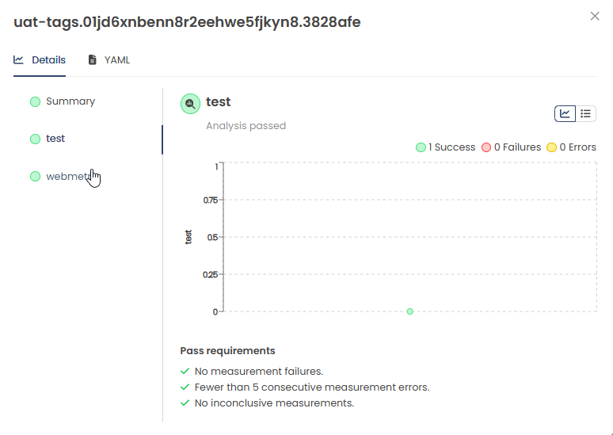

GitOps sounds too good to be true. The idea of syncing the state of your systems and applications from a single source of truth in Git feels so natural and intuitive. GitOps offers many advantages, like having a versioned track record of your application. However, as great as this sounds, it's only part of the picture.

In this article, I’ll take you on my journey to discover the missing piece in GitOps and explore a tool that might fill the gap: **Kargo**. I’ll describe how I investigated Kargo and how something initially abstract and hard to grasp turned into a tool that left me with great conclusions.

## The Missing Piece

But first, about the problem. GitOps tooling has matured, and the choice of tools often depends on convenience and user needs rather than functionality. A classic GitOps setup might look like the diagram below: you have two repositories—one for your application code and CI configurations, and another for your application manifests (or templates to generate them). A GitOps operator (like ArgoCD) ensures that the cluster's state is synchronized with the desired state defined in your repository.

For environments, whether logical or physical, you typically separate configurations in your repository. The GitOps operator then points to different branches or folders based on the target environment.


In this example, ArgoCD monitors the `develop` branch for one environment and the `main` branch for another. This simplistic view glosses over the complexity of managing multiple environments that applications traverse before reaching production.

Ultimately, the promotion mechanism in GitOps involves either
- updating the Git repository to reflect the desired state for a specific environment, often through branch merges or updates to designated configuration directories, or
- tagging or marking a specific commit to indicate it as the source of truth for synchronization.

At its core, it's just a file change or a commit tag in the repository—simple, right?

This simplicity can be both compelling and dangerous. It might work in small teams or limited scopes, but imagine hundreds of developers working across hundreds of repositories daily, trying to remember which combination of commits has been deployed, tested, and is safe for production. 

Imagine the following scenarios:
- A post-mortem meeting reveals that Laura was on vacation, and Jimmy who usually doesn't takes care of deploying resources accidentally tagged a commit with the wrong feature flags for production.
- An incident call on a Friday night finds Bob mistakenly promoting a database schema change into production due to a mix-up in image tags.

> **How can we safely promote our applications across environments while maintaining visibility and control? How can we track what gets deployed where, without being constrained by the linear, rigid structure of traditional deployment pipelines?**

## The Promise

**Kargo** promises to fill this gap. It takes a while to wrap your head around but it's worth it. Kargo allows you to define stages, their dependencies, and track delivery artifact combinations (e.g., Helm charts and image tags) across their lifecycle. Additionally, it handles manifest generation and delivery to Git sources.
Kargo provides a user interface where users can assemble combinations of delivery artifacts (called `Freight`) and easily track what combination is deployed at each stage of their delivery process.


## But How?

To do this, Kargo comes with a number of custom resources. I recommend you reading about the [key concepts](https://docs.kargo.io/concepts#the-basics) in the Kargo documentation to learn more about what the custom resources in the picture below do. 


Using a `Warehouse` Kargo creates combinations of versioned artifacts from different sources, called `Freight`. You can customize `Stages` that define the order in which `Freight` must be deployed to different `Stages`. A `Stage` is a term for a deployment of the service that fulfills a certain purpose, i.e. a user acceptance test or whatever you like. A `Stage` defines the mechanisms, by which a `Promotion` of `Freight` from a specific `Warehouse` or a previous `Stage` can be done. 

Using the steps described in a `Stage`, a `Promotion` will execute the necessary actions, e.g. update the image tag in your helm chart to deliver the combination of your helm chart and individual image tag and commit the result back to your desired location in Git either by a direct commit or using a Pull Request in case you want more control about your delivery.

Last but not least, Kargo allows you to automatically perform `AnalysisRuns` to assess the health of your promoted resources. This enables you to perform extensive testing of your resources similar as in the good-old CICD pipelines.

### Excurse: Rendered Manifests Pattern
In the previous paragraphs you learned that Kargo will commit back to your repository. So now, it's time to talk about what and why Kargo commits to your Git.


Kargo emphasizes the **rendered manifests pattern**, which stores pre-rendered manifests directly in your Git repository instead of relying on tools like ArgoCD to render them at runtime.

Imagine a scenario where you pointed your ArgoCD Application to watch a repository containing a Helm Chart. Under the hood, ArgoCD will execute  `helm template` to create the manifests. A seemingly small commit of a dependency chart in a Pull Request might lead to ArgoCD to create undesired resources in your cluster and you will not be able to tell upfront from by looking at your sources. Storing the rendered manifests in Git allows for full transparency of your desired state within Git. 

Usually, you either store your rendered manifests in separate branches per environment or in different folders within a branch. In both cases, a separate destination for your manifests will also avoid conflicts on your branches. 

If you want to learn more about this pattern, I'd recommend to check this [article by Akuity](https://akuity.io/blog/the-rendered-manifests-pattern).
### Warehouses & Freight

To achieve this, you create a `warehouse` resource in which you define the repositories to watch. In case Kargo recognizes a new commit or tag in the repositories, it will offer you to bundle it in a unique combination of your artifacts called `Freight`. 

```yaml
apiVersion: kargo.akuity.io/v1alpha1
kind: Warehouse
metadata:
  name: kargo-poc
  namespace: kargo-poc
spec:
  interval: 10s
  subscriptions:
  - image:
      repoURL: registry.com/service-image:1.0.0
      discoveryLimit: 5
      imageSelectionStrategy: SemVer
  - git:
      repoURL: https://github.com/service-cicd.git
      commitSelectionStrategy: SemVer
      strictSemvers: false
```

Therefore, a `Freight` is a unique combination of references to one or more versioned artifacts from a warehouse. 

Kargo lets you decide if you want it to create `Freight` from each commit or tag it identifies or only from tags using Semantic Versioning. 
### Stages

A `Stage` let's you define what kind of input you allow (either from a previous `Stage` or a `Warehouse`). Looking at the `Stage` below, you can see it accepts `Freight` from the a `Warehouse ` called `kargo-poc` and requires it to come from a previous `Stage` called _teststable-tags_. 

```yaml 
apiVersion: kargo.akuity.io/v1alpha1
kind: Stage
metadata:
  name: uat-tags
  namespace: kargo-poc-tags
  annotations:
    kargo.akuity.io/color: green
spec:
  requestedFreight:
  - origin:
      kind: Warehouse
      name: kargo-poc-tags
    sources:
      stages:
        - teststable-tags
  verification:
    analysisTemplates:
    - name: kargo-poc-uat-analysis
  promotionTemplate:
    spec:
      steps:
      - uses: git-clone
        config:
          repoURL: https://github.com/service-cicd.git
          checkout:
          - branch: develop
            path: ./src
      - uses: git-clear
        config:
          path: ./out/stages/uat
      - uses: helm-update-image
        as: update-image
        config:
          path: ./src/chart/service/values-uat.yaml
          images:
          - image: image-registry.com/service-image
            key: image.tag
            value: Tag
      - uses: helm-template
        config:
          releaseName: service
          path: ./src/chart/techcelerate-service
          valuesFiles:
            - ./src/chart/techcelerate-service/values-uat.yaml
          outPath: ./out/stages/uat/manifests.yaml
      - uses: git-commit
        as: commit
        config:
          path: ./out/stages/uat
          messageFromSteps:
          - update-image
      - uses: git-push
        as: push
        config:
          path: ./out/stages/uat
          generateTargetBranch: true
      - uses: git-open-pr
        as: open-pr
        config:
          repoURL: https://github.com/service-cicd.git
          sourceBranchFromStep: push
          targetBranch: develop
      - uses: git-wait-for-pr
        config:
          repoURL: https://github.com/service-cicd.git
          provider: gitlab
          prNumberFromStep: open-pr
        as: wait-pr
      - uses : argocd-update
        config:
          apps:
            - name: service-uat
              namespace: argocd
              sources:
                - repoURL: https://github.com/service-cicd.git
                  desiredCommitFromStep: wait-pr
```

Having selected the _uat-tags_ `Stage`, I'm no longer able to promote any arbitrary `Freight` but I have to select one that has been successfully deployed to _teststable-tags_ before.


Once I started the `Promotion` of a my `Freight` you can see what the PromotionTemplate from the `Stage` does. It creates a certain number of steps that will be executed and result in a Pull Request with the actual changes being created. 


Once the PR is merged, ArgoCD will take care to deploy the newest version of my release as usual and Kargo wills start the `AnalysisRun`. 

### AnalysisTemplates are the key 
Kargo reuses the `AnalysisTemplate` resource of Argo Rollouts. This means, you must have the Argo Rollouts Operator installed on your cluster. It's a small price for the flexibility it offers you. Using `AnalysisTemplate`, you can choose from 11 predefined metrics providers to base your tests on, including arbitrary Kubernetes Jobs. 

```
apiVersion: argoproj.io/v1alpha1
kind: AnalysisTemplate
metadata:
  name: kargo-poc-uat
  namespace: kargo-poc
spec:
  metrics:
  - name: webmetric
    successCondition: result == "Hello Audience!"
    provider:
      web:
        url: "https://my-service.kargo-demo.com/test"
        timeoutSeconds: 20 # defaults to 10 seconds
        jsonPath: "{$.message}"
  - name: test
    provider:
      job:
        metadata:
        spec:
          backoffLimit: 1
          template:
            spec:
              containers:
              - name: test
                image: dockerhub.devops.telekom.de/grafana:k6
                command:
                ## Custom logic for a loadtest/e2e test?
                - k6 run loadtest.js
              restartPolicy: Never
```

Each `AnalysisTemplate` can be referenced in different stages of your deployment flow and will be executed afterwards. The results can be seen in the UI but you can obviously also query them from the Kubernetes resource.


Looking at this, you will be able to run **any** test for the deployments you made. Literally **any**. This is a great implementation to enable similar testing functionality as you get from linear pipelines in different stages. 

## What I particularly liked!

### K8s native
Kargo uses custom resources to realize all it's functionality. This is a pretty big plus because it fits very well into a K8s and operator-centric world we try to build. 

### User Interface
The user interface is simple and lightweight. It does what it needs to do and makes very clear what is deployed and what's the history of your `Freight`. While I personally don't really need a user interface, I can see the potential value for our developers in it, getting a quick overview about their delivery lifecycle.

### Cluster Separation
If you are using an approach in which you have a management cluster and target clusters to run your actual workloads on, Kargo will integrate into this concept surprisingly well. The fact that all custom resources created by Kargo are applied and processed on your management cluster makes you completly independent of your target clusters. 

### Rendered Manifests
Kargo heavily features the rendered manifests approach. This means that the manifests of your sources are rendered and then committed into a branch or folder where your GitOps Operator fetches them. This brings additional benefits as small changes, e.g. in the version of a chart can lead to massive changes in the rendered manifests. Using this approach a Pull Request will always show you the **actual** impact of a change.

### ArgoCD & Rollouts Integration
Kargo perfectly fits the spot between your delivery artifacts and GitOps. I particularly liked that it **doesn't try to reinvent the wheel.** It implements very well into existing solutions & workflows. Offering a simple ArgoCD sync mechanism is the perfect solution. The analysis capabilities of ArgoRollouts were not just reused but I also found that the verification steps in Kargo would respect the time it takes ArgoRollouts to deploy a full set of changes when using a step-wise deployment (e.g. canary). Perfect!

### Community/Maintainers
For a couple of questions and issues I had to reach out to Kargo on Github. The speed in which I was getting helped with my issues was astonishing. It took maximum a few hours to get a helpful answer from the maintainers about my issues.
### Installation
Kargo is quite straight-forward to install. You can find the instructions in their documentation but it comes down to installing a helm chart. Similarly to related software like ArgoCD, the quality of the helm chart seems to be high, leaving almost nothing to wish for. 

## Conclusion
Kargo has released version 1.0 a few weeks ago. It's amazing what this product already offers. When we started building a new platform based on GitOps principles with a huge number of developers in mind, I had no idea how to solve the problem of securely promoting artifacts. Kargo brings **a lot** of good ideas and a surprising amount of implemented features even in version 1.0. Yes, the documentation is blurry and yes, there might be the one bug or the other. But for me, I see vast potential in this solution to solve a problem in a way I couldn't have imagined before. 

During my poc, I found myself thinking "Yes but I can still do this with tags in Git", until I tested the verification functionality. For me this seems to really solve a substantial problem with GitOps. Being able to verify your promoted resources right away, automatically without triggering some external system and Kargo keeping track of the results and even visualizing it for me is... 
Call me a simple mind but I think it's mind-blowing.

